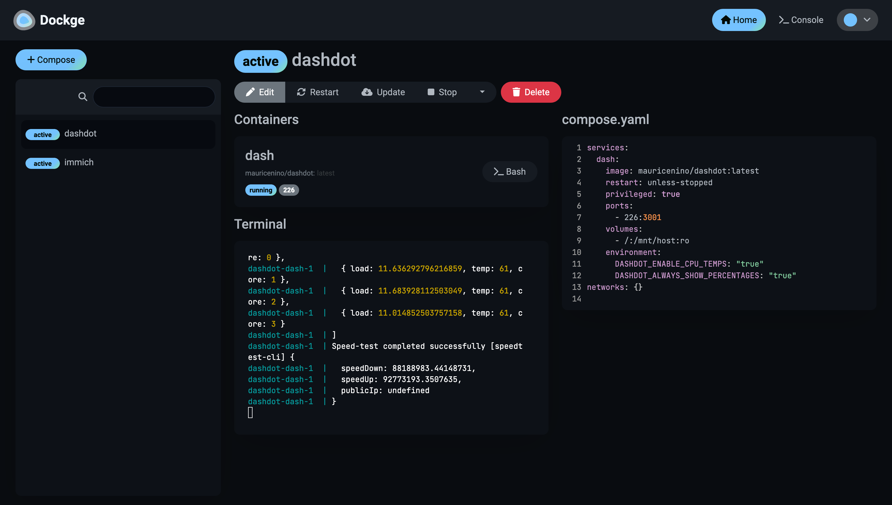

# Dockge

Dockge is a simple way to manage and view your docker containers. You can see the logging within the dashboard and write all your docker compose files within the web interface. It is my preferred way to start any docker container and manage it. Because it is a powerful tool, I'd recommend to only have it accessible on the home network.


_Dockge with the Dash. service selected_

## Installation

Installation is very straightforward. Create two directories: `/opt/stacks` and `/opt/dockge`. Ensure your unpriviliged user owns these two directories, so installing the docker compose file is easy.

Next, install the docker compose file inside the `/opt/dockge` directory by using the following command:

```
curl "https://dockge.kuma.pet/compose.yaml?port=5001&stacksPath=%2Fopt%2Fstacks" --output compose.yaml
```

Run the compose file by running `docker compose up -d`. After this, you can access your dockge instance on port `5001`.

## Usage

After installing dockge, you can create an account within the web interface.

You can create images by clicking 'compose' and entering a name, a compose file on the right and selecting the correct env variables. You can also enter a `docker run` command and convert it to a compose file.